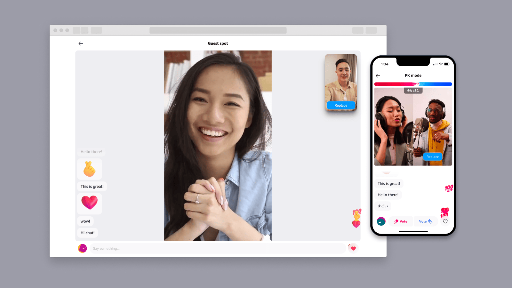

# Amazon IVS Real-time for Web Demo

A demo web application intended as an educational tool to demonstrate how you can build a real-time collaborative UGC streaming experience with [Amazon IVS Real-time](https://ivs.rocks/real-time). Check out a hosted version of this demo at https://rt.ivs.rocks/.

**This project is intended for education purposes only and not for production usage.**

## Prerequisites

- [NodeJS](https://nodejs.org/) v20.10.0 and Node package manager (npm).
- To create and share your own real-time streams, you must deploy the [Amazon IVS Real-time Serverless Demo](https://github.com/aws-samples/amazon-ivs-real-time-serverless-demo). After deploying the serverless demo, note the outputs: `Customer ID` and `API key`.
  - You may also deploy the serverless demo from the **Manage AWS Account** screen in the app settings. Refer to the [Setup - Serverless](#setup---serverless) section in this readme for more details.

## Setup - Webapp

To run the application locally, take the following steps:

1. Run: `npm ci`
2. Run: `npm run dev`
3. Open `http://localhost:5173` in your web browser and select `Continue` to enter the demo.

## Setup - Serverless

To create your own streams, you must deploy the [Amazon IVS Real-time Serverless Demo](https://github.com/aws-samples/amazon-ivs-real-time-serverless-demo).

Deploy using the command line:

1. Visit the [Amazon IVS Real-time Serverless Demo](https://github.com/aws-samples/amazon-ivs-real-time-serverless-demo) repository.
2. Follow the instructions in the README to deploy the application to your AWS account.
3. After deploying the serverless demo, note the outputs: `Customer ID` and `API key`.
4. While the app is running locally, visit `http://localhost:5173/custom` and enter the combined `Customer ID` and `API key` when prompted

- For example: `a1bcde23456f7g-abcDeFghIQaTbTxd0T95`

Deploy using the AWS web console:

1. While the app is running locally, visit `http://localhost:5173/settings/connect` and follow the instructions.

**IMPORTANT NOTE:** Joining a stage and streaming in the app will create and consume AWS resources, which will cost money.

## Known Issues and Limitations

- A list of known issues for the Amazon IVS Broadcast SDK is available on the following page: [Amazon IVS Web Broadcast SDK: Known Issues and Workarounds](https://aws.github.io/amazon-ivs-web-broadcast/docs/real-time-sdk-guides/known-issues)
- The application is meant for demonstration purposes and **not** for production use.
- This application is only tested and supported on the latest Desktop version of Chrome and Safari. Other browsers and devices may work with this tool, but are not officially supported at this time.

## About Amazon IVS

Amazon Interactive Video Service (Amazon IVS) is a managed live streaming and stream chat solution that is quick and easy to set up, and ideal for creating interactive video experiences. [Learn more](https://aws.amazon.com/ivs/).

- [Amazon IVS docs](https://docs.aws.amazon.com/ivs/)
- [User Guide](https://docs.aws.amazon.com/ivs/latest/userguide/)
- [API Reference](https://docs.aws.amazon.com/ivs/latest/APIReference/)
- [Setting Up for Streaming with Amazon Interactive Video Service](https://aws.amazon.com/blogs/media/setting-up-for-streaming-with-amazon-ivs/)
- [Learn more about Amazon IVS on IVS.rocks](https://ivs.rocks/)
- [View more demos like this](https://ivs.rocks/examples)

## License

This project is licensed under the MIT-0 License. See the LICENSE file.
